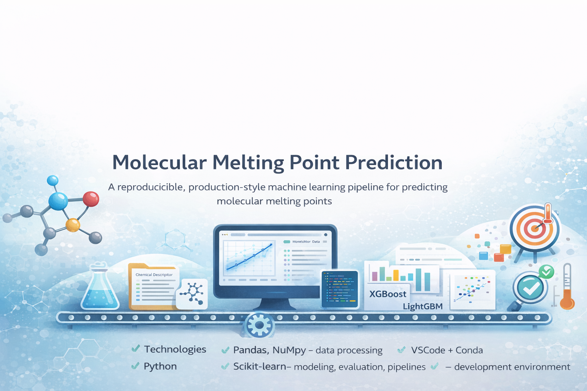

#  Molecular Melting Point Prediction
A fully reproducible, production-style machine learning pipeline for predicting molecular melting points using engineered chemical descriptors and tabular feature reduction techniques.

---

##  Overview
This project focuses on building a scalable and maintainable ML workflow rather than just achieving a single leaderboard score.  
It demonstrates how I:
- design end-to-end pipelines
- manage experiments systematically
- think about performance, reproducibility, and collaboration

---

##  Technologies I Used
- **Python** (core language)
- **Pandas, NumPy** – data processing
- **Scikit-learn** – modeling, evaluation, pipelines
- **XGBoost, LightGBM** – boosting models
- **RDKit** – chemistry feature generation
- **SciPy / Sparse Matrices** – efficient memory handling
- **Joblib** – model persistence
- **Matplotlib / Seaborn** – visualization
- **VSCode + Conda Environment** – development environment

---

##  Main Features
✔️ Clean, modular, production-ready project structure  
✔️ Automated feature engineering & feature reduction  
✔️ K-Fold evaluation with experiment logging  
✔️ Model comparison workflow  
✔️ Hyperparameter tuning pipeline  
✔️ Reproducible scripts (build → train → inference)  
✔️ Results tracking + metrics summary CSV  
✔️ Designed with “team collaboration” mindset

---

##  What Users Can Do
You can:
- preprocess the dataset
- build molecular descriptors
- reduce high-dimensional features
- train baseline + tuned models
- compare model performance
- reproduce every stage consistently
- extend the pipeline easily

---

